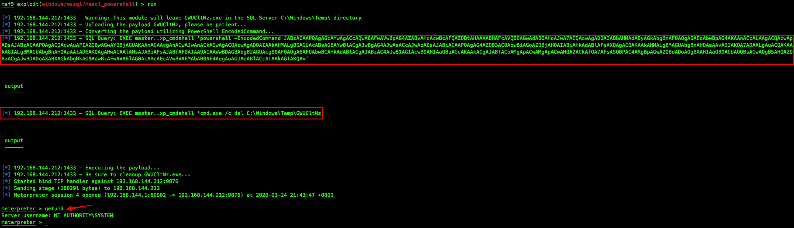
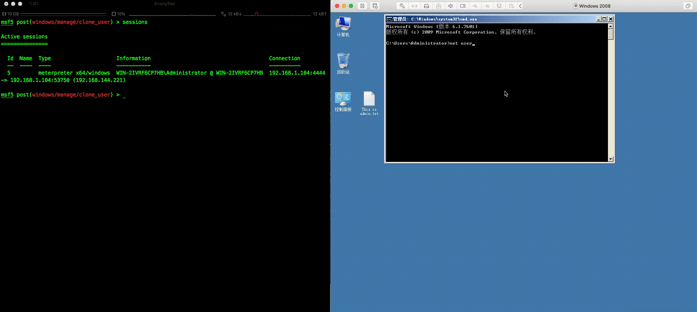
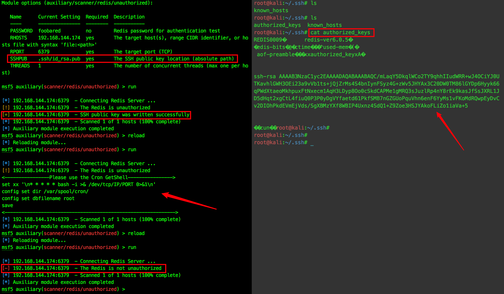
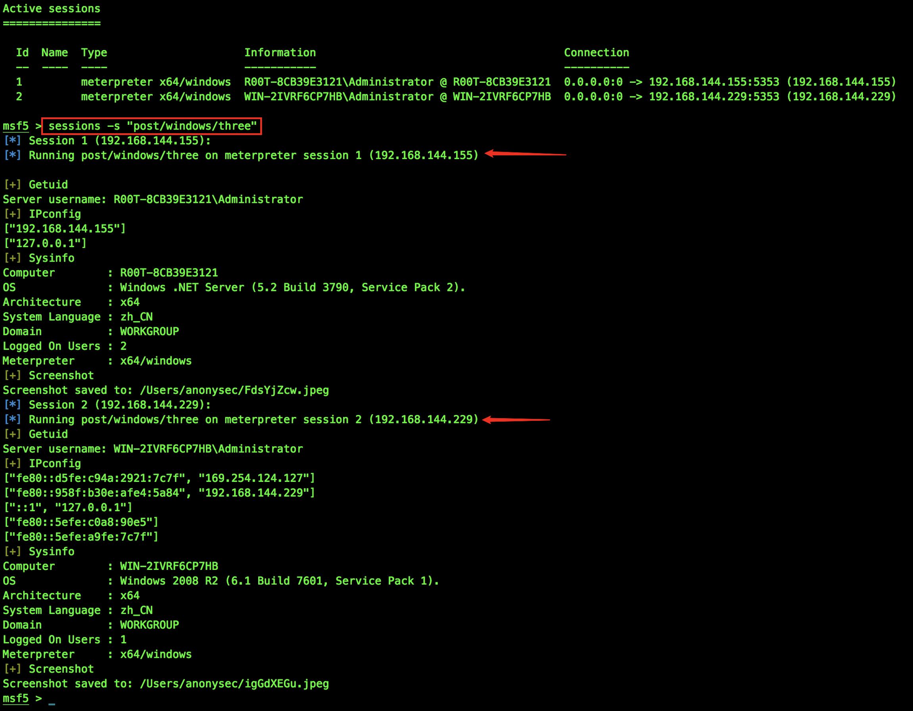
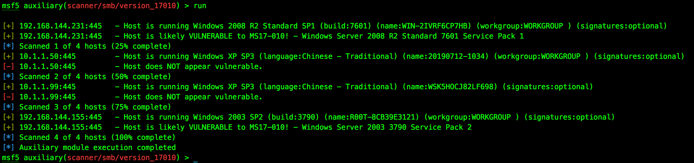
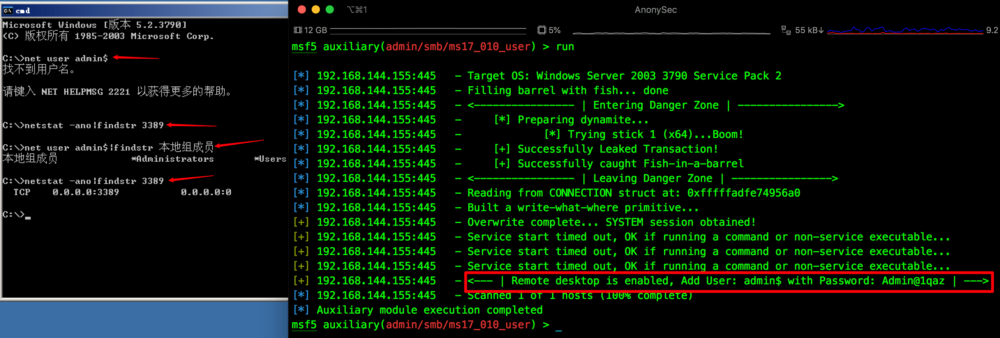

## Metasploit 模块开发

**需要在metasploit中使用如下命令**

- `loadpath 绝对路径/Metasploit/` 载入外部模块
- `setg proxies type:host:port[,type:host:port]` 全局代理 (支持代理链)
- `setg ReverseAllowProxy true` 允许反向代理 (通过socks反弹shell，建立双向通道)

## Change Log

### mssql_powershell

**2020/03/25** 

[打造定制化的Metasploit—MSSQL重构](https://payloads.cn/2020/0325/create-customized-metasploit%E2%80%94mssql-refactoring.html)

利用Metasploit，通过正确的SQL Server口令信息，可启用`xp_cmdshell`，并获取目标系统`session`。



### clone_user

**2020/03/27** 

[打造定制化的Metasploit—克隆用户](https://payloads.cn/2020/0327/create-customized-metasploitclone-users.html) 

利用已获取`session`，创建登录账户，添加该账户到管理员与远程桌面组，并克隆administrator，从而替代`clone.exe`。

( 支持尝试提权，默认随机8位密码，用户不能设置Guest，应用RID劫持技术)



### unauthorized

**2020/03/31**

[打造定制化的Metasploit—Redis未授权](https://payloads.cn/2020/0331/create-customized-metasploit%E2%80%94unauthorized-by-redis.html) 

批量扫描Redis未授权漏洞，若存在，探测`/root/.ssh/`与`/var/spool/cron/`目录权限，可写入`id_rsa.pub`到目标服务器（`id_rsa.pub`应设置绝对路径），或提示`Cron`反弹命令。



### three

**2020/05/20** 

批量执行三要素：getuid、ipconfig、sysinfo，并截图当前桌面。

`sessions -C "run post/windows/three"` 或 `sessions -s "post/windows/three"`



### mail_user

**2020/05/31** 

[打造定制化的Metasploit—邮服用户枚举](https://payloads.cn/2020/0531/create-customized-metasploit%E2%80%94enumeration-of-mail-service-users.html) 

通过某邮服用户接口，枚举存在的用户名，并输出到txt文本。

### version_17010

**2020/07/01** 

同一主机，既SMB版本检测也MS17-010 SMB RCE检测。



### eventlog

**2020/07/03** 

[打造定制化的Metasploit—安全日志分析](https://payloads.cn/2020/0703/create-customized-metasploitsecurity-log-analysis.html) 

使用PowerShell分析安全日志中登录成功与失败的事件，并快速提取相关信息。

( 需要将`EventLog.ps1`放在 Metasploit 的`/data/post/powershell`目录下；适用Windows2008以上版本，调用`wevtutil.exe`与`powershell.exe` )


### collect

**2020/07/15**

[打造定制化的Metasploit—主机信息收集](https://payloads.cn/2020/0718/create-customized-metasploit%E2%80%94host-information-collection.html) 

收集 已安装的应用程序、主机凭据`cmdkey /list && vaultcmd /list`、网络连接`netstat -ano|findstr ESTABLISHED`、Internet Explorer历史记录、Google Chrome历史记录与保存的密码。

批量执行

```sh
msf5 > sessions -C "run post/windows/gather/collect migrate=true"
```

(如是`exploit/windows/smb/psexec`的session，需`set migrate true`，自动注入进程)


### ms17_010_user

**2020/07/31**

通过ms17_010漏洞，添加`admin$`用户于管理员组，并开启远程桌面。(适用 Windows 2003)



------

💪	**持续更新中 ...**
